# React Complete Guide - دليل React الشامل

## جدول المحتويات
1. [المفاهيم الأساسية](#المفاهيم-الأساسية)
2. [Hooks الأساسية](#hooks-الأساسية)
3. [Hooks المتقدمة](#hooks-المتقدمة)
4. [Patterns و Best Practices](#patterns-و-best-practices)
5. [استخدامات حقيقية](#استخدامات-حقيقية)

---

## المفاهيم الأساسية

### 1. Components (المكونات)

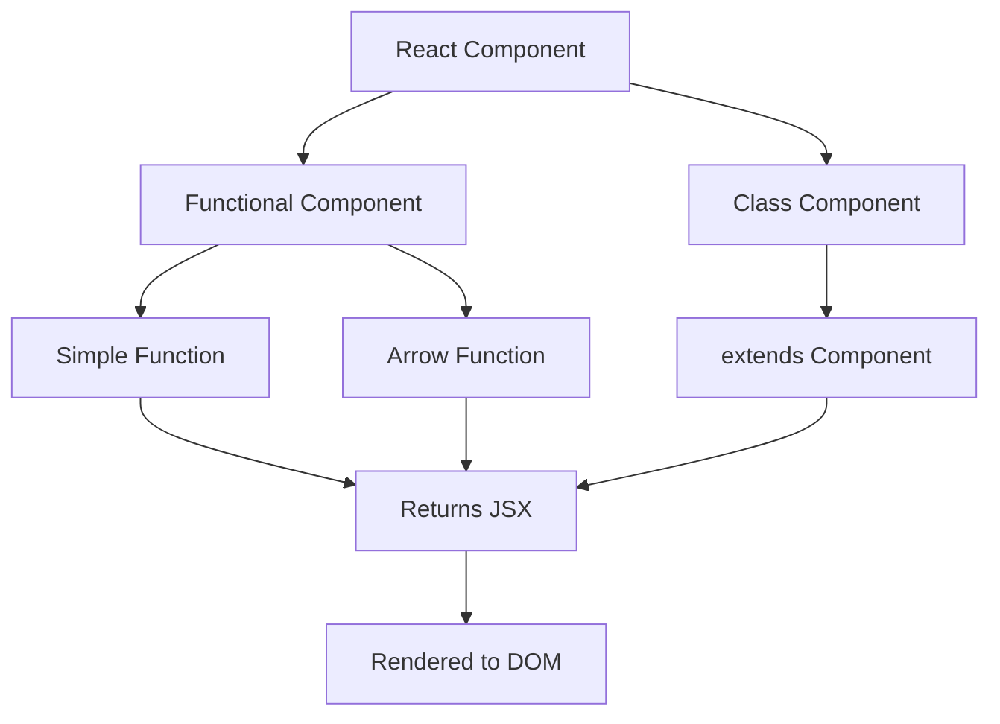
```mermaid
graph TD
    A[React Component] --> B[Functional Component]
    A --> C[Class Component]
    B --> D[Simple Function]
    B --> E[Arrow Function]
    C --> F[extends Component]
    
    D --> G[Returns JSX]
    E --> G
    F --> G
    
    G --> H[Rendered to DOM]
```

**الاستخدام الحقيقي:**
- تقسيم الواجهة إلى مكونات قابلة لإعادة الاستخدام
- فصل الاهتمامات (Separation of Concerns)
- سهولة الصيانة والاختبار

### 2. Props (الخصائص)

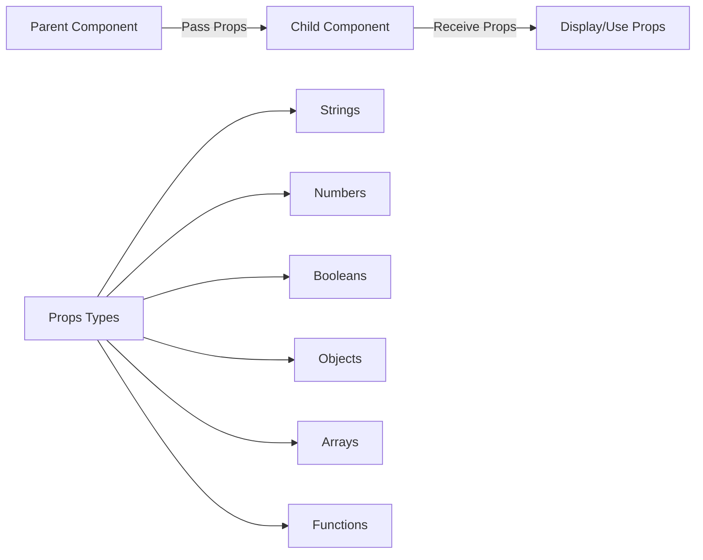
```mermaid
graph LR
    A[Parent Component] -->|Pass Props| B[Child Component]
    B -->|Receive Props| C[Display/Use Props]
    
    D[Props Types] --> E[Strings]
    D --> F[Numbers]
    D --> G[Booleans]
    D --> H[Objects]
    D --> I[Arrays]
    D --> J[Functions]
```

**الاستخدام الحقيقي:**
- تمرير البيانات من المكون الأب للابن
- تكوين المكونات بشكل ديناميكي
- إعادة استخدام المكونات مع بيانات مختلفة

### 3. State (الحالة)

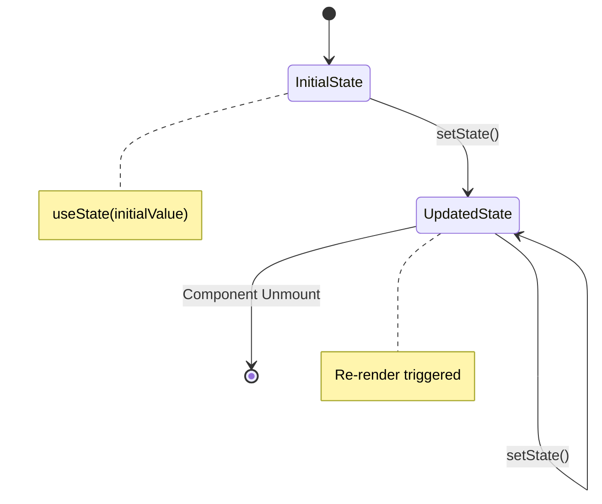
```mermaid
stateDiagram-v2
    [*] --> InitialState
    InitialState --> UpdatedState: setState()
    UpdatedState --> UpdatedState: setState()
    UpdatedState --> [*]: Component Unmount
    
    note right of InitialState
        useState(initialValue)
    end note
    
    note right of UpdatedState
        Re-render triggered
    end note
```

**الاستخدام الحقيقي:**
- إدارة حالة المكونات
- تحديث الواجهة بناءً على تفاعل المستخدم
- حفظ البيانات المؤقتة

---

## Hooks الأساسية

### 1. useState

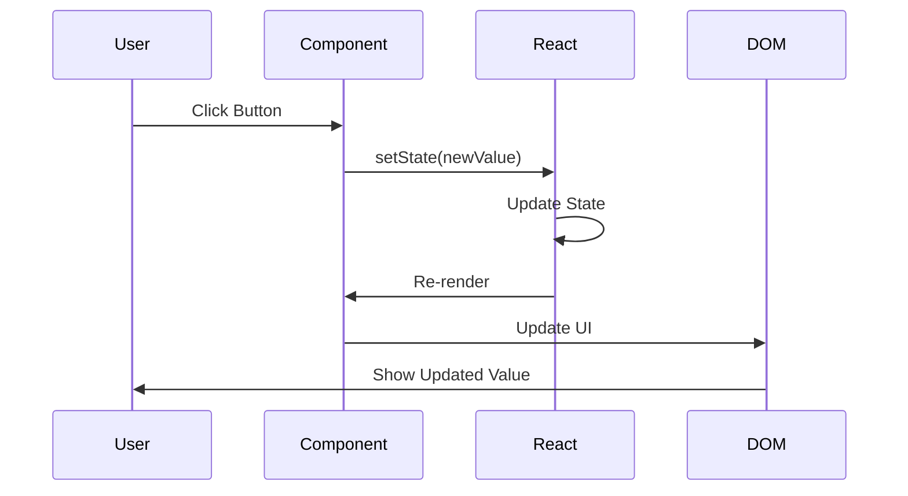
```mermaid
sequenceDiagram
    participant User
    participant Component
    participant React
    participant DOM
    
    User->>Component: Click Button
    Component->>React: setState(newValue)
    React->>React: Update State
    React->>Component: Re-render
    Component->>DOM: Update UI
    DOM->>User: Show Updated Value
```

**الاستخدام الحقيقي:**
- إدارة النماذج (Forms)
- العدادات (Counters)
- التبديلات (Toggles)
- القوائم (Lists)

### 2. useEffect

```mermaid
graph TD
    A[Component Mounts] --> B[useEffect Runs]
    B --> C{Has Dependencies?}
    
    C -->|No Dependencies []| D[Run Once]
    C -->|Has Dependencies| E[Run on Dependency Change]
    C -->|No Array| F[Run Every Render]
    
    D --> G[Cleanup on Unmount]
    E --> H[Cleanup Before Re-run]
    F --> I[May Cause Infinite Loop]
    
    J[Common Use Cases] --> K[API Calls]
    J --> L[Subscriptions]
    J --> M[Timers]
    J --> N[DOM Manipulation]
```

**الاستخدام الحقيقي:**
- جلب البيانات من APIs
- الاشتراكات (WebSocket, Event Listeners)
- Timers و Intervals
- تنظيف الموارد

### 3. useContext

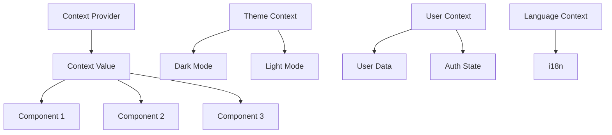
```mermaid
graph TB
    A[Context Provider] --> B[Context Value]
    B --> C[Component 1]
    B --> D[Component 2]
    B --> E[Component 3]
    
    F[Theme Context] --> G[Dark Mode]
    F --> H[Light Mode]
    
    I[User Context] --> J[User Data]
    I --> K[Auth State]
    
    L[Language Context] --> M[i18n]
```

**الاستخدام الحقيقي:**
- إدارة الثيم (Theme)
- بيانات المستخدم (User Data)
- اللغة (i18n)
- الإعدادات العامة

### 4. useRef

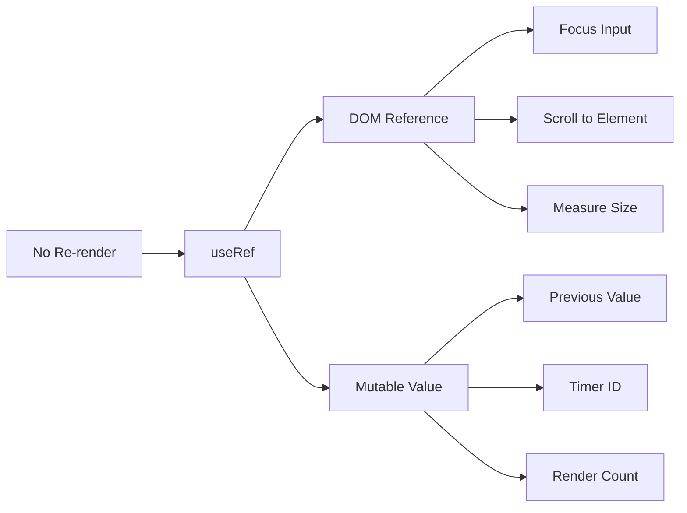
```mermaid
graph LR
    A[useRef] --> B[DOM Reference]
    A --> C[Mutable Value]
    
    B --> D[Focus Input]
    B --> E[Scroll to Element]
    B --> F[Measure Size]
    
    C --> G[Previous Value]
    C --> H[Timer ID]
    C --> I[Render Count]
    
    J[No Re-render] --> A
```

**الاستخدام الحقيقي:**
- الوصول المباشر للـ DOM
- حفظ القيم السابقة
- Timer IDs
- Integration مع مكتبات خارجية

---

## Hooks المتقدمة

### 1. useMemo

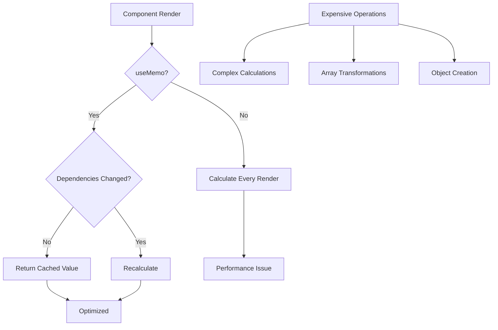
```mermaid
graph TD
    A[Component Render] --> B{useMemo?}
    B -->|No| C[Calculate Every Render]
    B -->|Yes| D{Dependencies Changed?}
    
    D -->|No| E[Return Cached Value]
    D -->|Yes| F[Recalculate]
    
    C --> G[Performance Issue]
    E --> H[Optimized]
    F --> H
    
    I[Expensive Operations] --> J[Complex Calculations]
    I --> K[Array Transformations]
    I --> L[Object Creation]
```

**الاستخدام الحقيقي:**
- حسابات مكلفة
- تحويلات المصفوفات الكبيرة
- تصفية وترتيب البيانات
- Memoization للقيم

### 2. useCallback

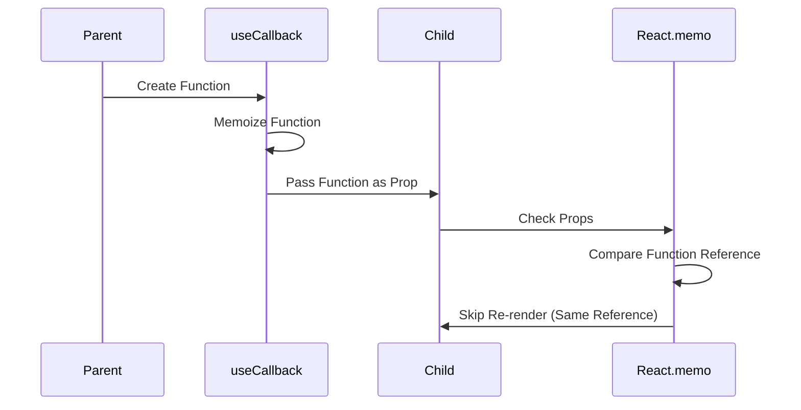
```mermaid
sequenceDiagram
    participant Parent
    participant useCallback
    participant Child
    participant React.memo
    
    Parent->>useCallback: Create Function
    useCallback->>useCallback: Memoize Function
    useCallback->>Child: Pass Function as Prop
    Child->>React.memo: Check Props
    React.memo->>React.memo: Compare Function Reference
    React.memo->>Child: Skip Re-render (Same Reference)
```

**الاستخدام الحقيقي:**
- تمرير الدوال للمكونات المحسّنة
- تحسين الأداء في القوائم الكبيرة
- منع re-renders غير ضرورية
- Context values

### 3. React.memo

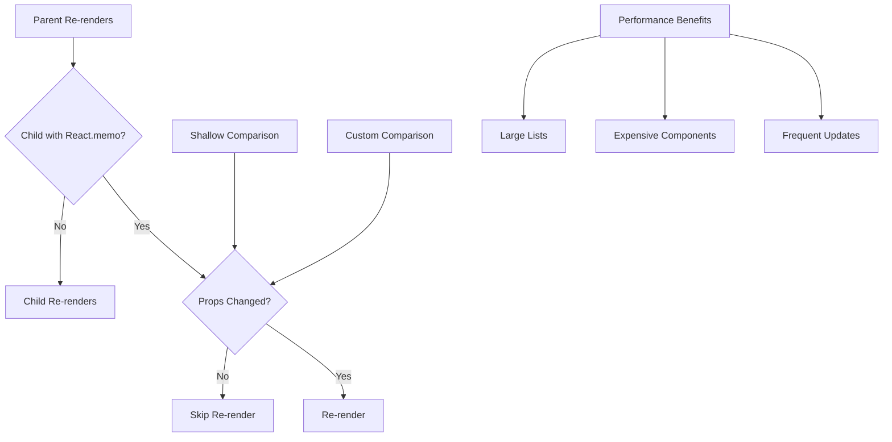
```mermaid
graph TD
    A[Parent Re-renders] --> B{Child with React.memo?}
    B -->|No| C[Child Re-renders]
    B -->|Yes| D{Props Changed?}
    
    D -->|No| E[Skip Re-render]
    D -->|Yes| F[Re-render]
    
    G[Shallow Comparison] --> D
    H[Custom Comparison] --> D
    
    I[Performance Benefits] --> J[Large Lists]
    I --> K[Expensive Components]
    I --> L[Frequent Updates]
```

**الاستخدام الحقيقي:**
- مكونات باهظة في الـ render
- قوائم كبيرة
- مكونات تستقبل props ثابتة غالباً
- تحسين الأداء العام

---

## Patterns و Best Practices

### 1. Component Composition

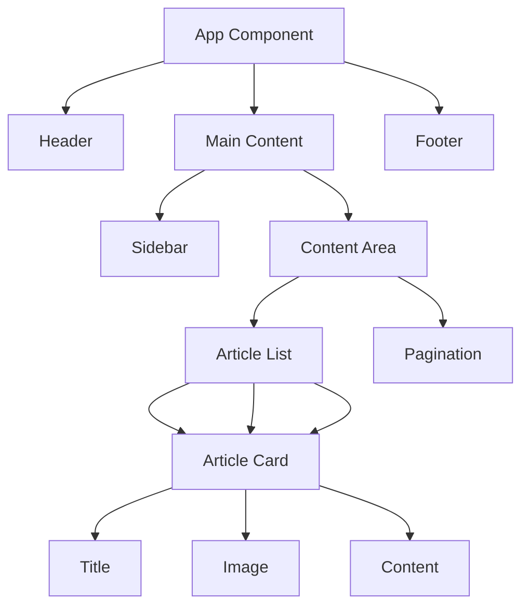
```mermaid
graph TB
    A[App Component] --> B[Header]
    A --> C[Main Content]
    A --> D[Footer]
    
    C --> E[Sidebar]
    C --> F[Content Area]
    
    F --> G[Article List]
    F --> H[Pagination]
    
    G --> I[Article Card]
    G --> I
    G --> I
    
    I --> J[Title]
    I --> K[Image]
    I --> L[Content]
```

**الاستخدام الحقيقي:**
- بناء واجهات معقدة من مكونات بسيطة
- إعادة استخدام المكونات
- سهولة الصيانة

### 2. Custom Hooks Pattern

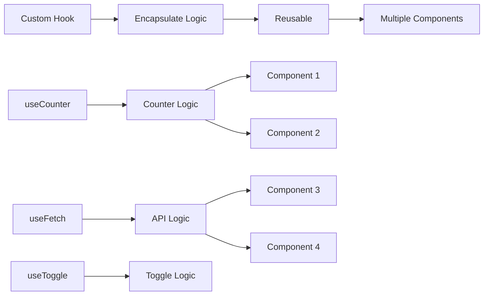
```mermaid
graph LR
    A[Custom Hook] --> B[Encapsulate Logic]
    B --> C[Reusable]
    C --> D[Multiple Components]
    
    E[useCounter] --> F[Counter Logic]
    G[useFetch] --> H[API Logic]
    I[useToggle] --> J[Toggle Logic]
    
    F --> K[Component 1]
    F --> L[Component 2]
    H --> M[Component 3]
    H --> N[Component 4]
```

**الاستخدام الحقيقي:**
- إعادة استخدام المنطق
- فصل المنطق عن العرض
- سهولة الاختبار
- تحسين التنظيم

### 3. State Management Patterns

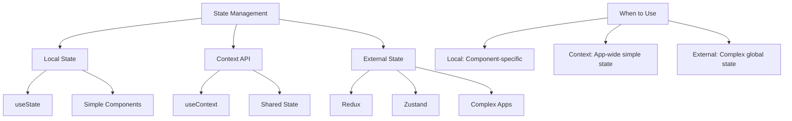
```mermaid
graph TD
    A[State Management] --> B[Local State]
    A --> C[Context API]
    A --> D[External State]
    
    B --> E[useState]
    B --> F[Simple Components]
    
    C --> G[useContext]
    C --> H[Shared State]
    
    D --> I[Redux]
    D --> J[Zustand]
    D --> K[Complex Apps]
    
    L[When to Use] --> M[Local: Component-specific]
    L --> N[Context: App-wide simple state]
    L --> O[External: Complex global state]
```

**الاستخدام الحقيقي:**
- **Local State**: بيانات خاصة بالمكون
- **Context**: ثيم، لغة، بيانات المستخدم
- **External**: تطبيقات معقدة، إدارة حالة متقدمة

---

## استخدامات حقيقية

### 1. Form Handling

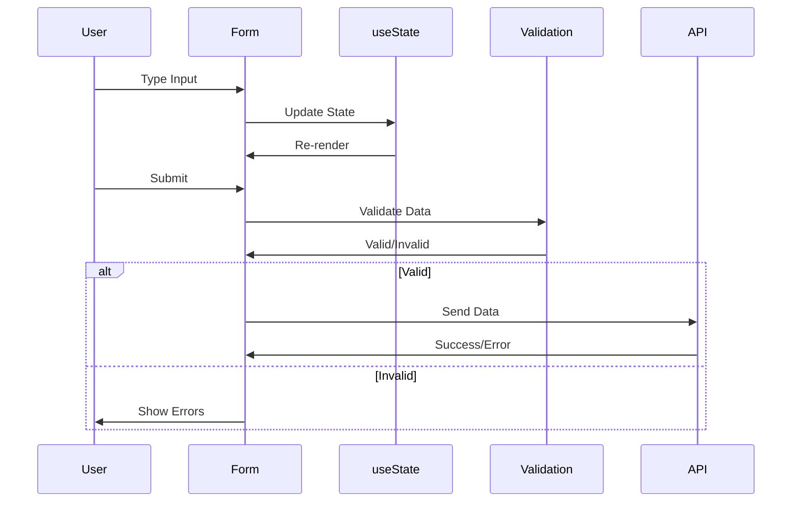
```mermaid
sequenceDiagram
    participant User
    participant Form
    participant useState
    participant Validation
    participant API
    
    User->>Form: Type Input
    Form->>useState: Update State
    useState->>Form: Re-render
    
    User->>Form: Submit
    Form->>Validation: Validate Data
    Validation->>Form: Valid/Invalid
    
    alt Valid
        Form->>API: Send Data
        API->>Form: Success/Error
    else Invalid
        Form->>User: Show Errors
    end
```

**مثال حقيقي:**
- نماذج تسجيل الدخول
- نماذج الاتصال
- نماذج الطلبات
- نماذج البحث

### 2. Data Fetching

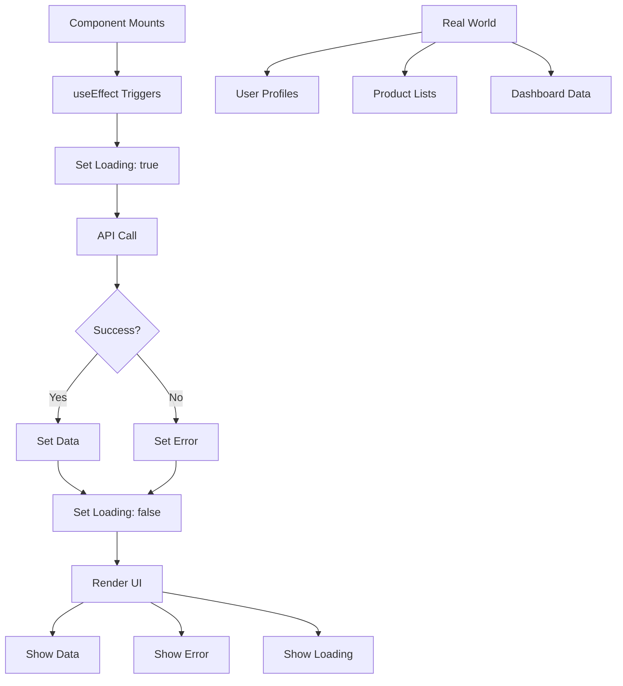
```mermaid
graph TD
    A[Component Mounts] --> B[useEffect Triggers]
    B --> C[Set Loading: true]
    C --> D[API Call]
    
    D --> E{Success?}
    E -->|Yes| F[Set Data]
    E -->|No| G[Set Error]
    
    F --> H[Set Loading: false]
    G --> H
    
    H --> I[Render UI]
    
    I --> J[Show Data]
    I --> K[Show Error]
    I --> L[Show Loading]
    
    M[Real World] --> N[User Profiles]
    M --> O[Product Lists]
    M --> P[Dashboard Data]
```

**مثال حقيقي:**
- جلب بيانات المستخدم
- قوائم المنتجات
- بيانات Dashboard
- البحث والفلترة

### 3. Real-time Updates

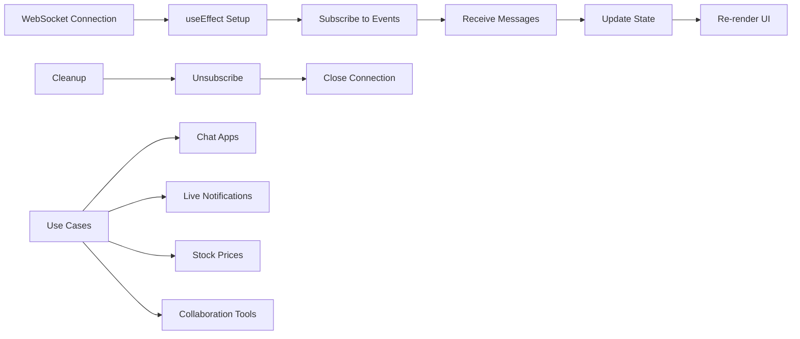
```mermaid
graph LR
    A[WebSocket Connection] --> B[useEffect Setup]
    B --> C[Subscribe to Events]
    C --> D[Receive Messages]
    D --> E[Update State]
    E --> F[Re-render UI]
    
    G[Cleanup] --> H[Unsubscribe]
    H --> I[Close Connection]
    
    J[Use Cases] --> K[Chat Apps]
    J --> L[Live Notifications]
    J --> M[Stock Prices]
    J --> N[Collaboration Tools]
```

**مثال حقيقي:**
- تطبيقات الدردشة
- الإشعارات المباشرة
- أسعار الأسهم
- أدوات التعاون

### 4. Performance Optimization

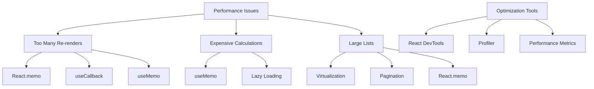
```mermaid
graph TD
    A[Performance Issues] --> B[Too Many Re-renders]
    A --> C[Expensive Calculations]
    A --> D[Large Lists]
    
    B --> E[React.memo]
    B --> F[useCallback]
    B --> G[useMemo]
    
    C --> H[useMemo]
    C --> I[Lazy Loading]
    
    D --> J[Virtualization]
    D --> K[Pagination]
    D --> L[React.memo]
    
    M[Optimization Tools] --> N[React DevTools]
    M --> O[Profiler]
    M --> P[Performance Metrics]
```

**مثال حقيقي:**
- قوائم كبيرة (1000+ عنصر)
- حسابات معقدة
- تطبيقات تفاعلية عالية
- Dashboards مع بيانات كثيرة

---

## Architecture Patterns

### 1. Container/Presentational Pattern

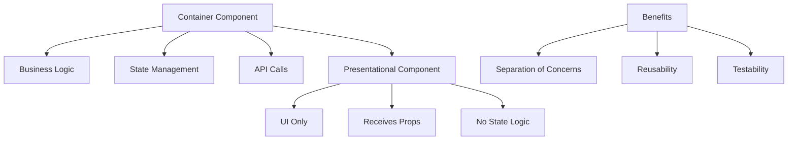
```mermaid
graph TB
    A[Container Component] --> B[Business Logic]
    A --> C[State Management]
    A --> D[API Calls]
    
    A --> E[Presentational Component]
    E --> F[UI Only]
    E --> G[Receives Props]
    E --> H[No State Logic]
    
    I[Benefits] --> J[Separation of Concerns]
    I --> K[Reusability]
    I --> L[Testability]
```

**الاستخدام الحقيقي:**
- فصل المنطق عن العرض
- سهولة الاختبار
- إعادة استخدام المكونات

### 2. Higher-Order Components (HOC)

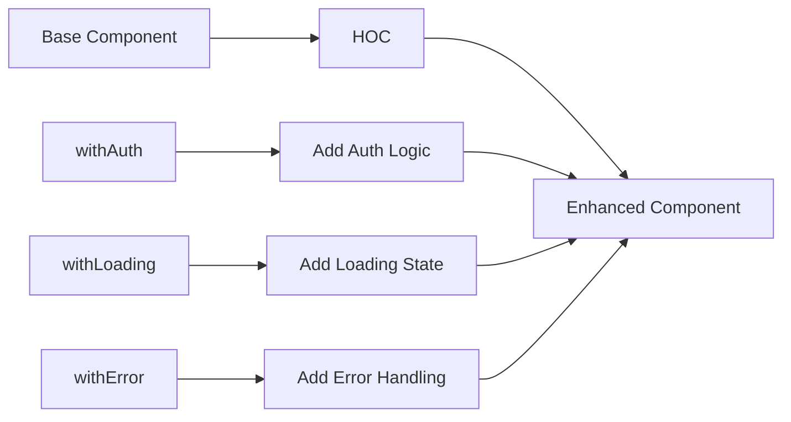
```mermaid
graph LR
    A[Base Component] --> B[HOC]
    B --> C[Enhanced Component]
    
    D[withAuth] --> E[Add Auth Logic]
    F[withLoading] --> G[Add Loading State]
    H[withError] --> I[Add Error Handling]
    
    E --> C
    G --> C
    I --> C
```

**الاستخدام الحقيقي:**
- إضافة وظائف مشتركة
- Authentication
- Error Handling
- Loading States

### 3. Render Props Pattern

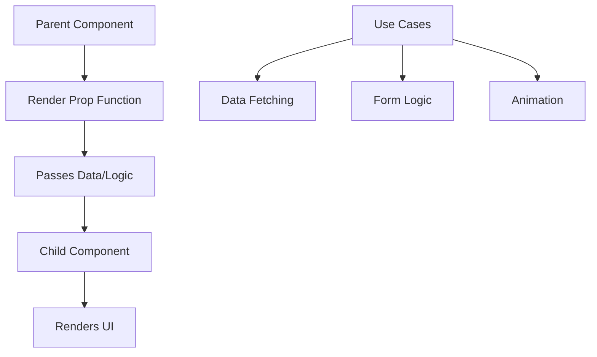
```mermaid
graph TD
    A[Parent Component] --> B[Render Prop Function]
    B --> C[Passes Data/Logic]
    C --> D[Child Component]
    D --> E[Renders UI]
    
    F[Use Cases] --> G[Data Fetching]
    F --> H[Form Logic]
    F --> I[Animation]
```

**الاستخدام الحقيقي:**
- مشاركة المنطق بين المكونات
- Flexibility في العرض
- Complex State Logic

---

## Best Practices Checklist

### ✅ Code Organization

```mermaid
graph TD
    A[Project Structure] --> B[Components/]
    A --> C[Hooks/]
    A --> D[Contexts/]
    A --> E[Utils/]
    A --> F[Types/]
    
    B --> G[Feature Folders]
    B --> H[Shared Components]
    
    C --> I[Custom Hooks]
    
    D --> J[Context Providers]
    
    E --> K[Helper Functions]
    
    F --> L[TypeScript Types]
```

### ✅ Performance

- [ ] استخدام `React.memo` للمكونات الباهظة
- [ ] استخدام `useMemo` للحسابات المكلفة
- [ ] استخدام `useCallback` للدوال الممررة
- [ ] Virtualization للقوائم الكبيرة
- [ ] Code Splitting و Lazy Loading

### ✅ State Management

- [ ] استخدام Local State للبيانات البسيطة
- [ ] استخدام Context للبيانات المشتركة
- [ ] تجنب Prop Drilling
- [ ] Normalize State Structure

### ✅ Error Handling

```mermaid
graph TD
    A[Error Boundary] --> B[Catch Errors]
    B --> C[Display Fallback UI]
    C --> D[Log Error]
    
    E[API Errors] --> F[Try/Catch]
    F --> G[Show User Message]
    
    H[Validation Errors] --> I[Form Validation]
    I --> J[Display Field Errors]
```

### ✅ Testing

- [ ] Unit Tests للمكونات
- [ ] Integration Tests للتفاعلات
- [ ] E2E Tests للمسارات الكاملة
- [ ] Test Coverage > 80%

---

## Real-World Examples

### 1. E-commerce Product Page

```mermaid
graph TB
    A[ProductPage] --> B[useEffect: Fetch Product]
    B --> C[useState: Product Data]
    B --> D[useState: Loading]
    B --> E[useState: Error]
    
    A --> F[ProductImage]
    A --> G[ProductInfo]
    A --> H[AddToCart Button]
    
    H --> I[useCallback: Handle Add]
    I --> J[Update Cart Context]
    
    G --> K[useMemo: Calculate Price]
    G --> L[useMemo: Format Description]
```

### 2. Social Media Feed

```mermaid
graph TD
    A[Feed Component] --> B[useEffect: Fetch Posts]
    B --> C[useState: Posts Array]
    
    C --> D[PostList]
    D --> E[PostItem - React.memo]
    E --> F[PostContent]
    E --> G[LikeButton - useCallback]
    E --> H[CommentButton - useCallback]
    
    G --> I[Update Like State]
    H --> J[Open Comments]
    
    K[Infinite Scroll] --> L[useEffect: Intersection Observer]
    L --> M[Load More Posts]
```

### 3. Dashboard with Real-time Data

```mermaid
graph LR
    A[Dashboard] --> B[WebSocket Connection]
    B --> C[useEffect: Setup]
    C --> D[Subscribe to Updates]
    D --> E[useState: Live Data]
    
    E --> F[Chart Component]
    E --> G[Stats Component]
    E --> H[Notifications]
    
    I[Cleanup] --> J[useEffect Return]
    J --> K[Unsubscribe]
    K --> L[Close Connection]
```

---

## Common Pitfalls و Solutions

### ❌ Pitfall 1: Infinite Loops

```mermaid
graph TD
    A[useEffect] --> B[setState]
    B --> C[Re-render]
    C --> A
    
    D[Solution] --> E[Add Dependencies]
    D --> F[Use Functional Updates]
    D --> G[Use useCallback]
```

### ❌ Pitfall 2: Stale Closures

```mermaid
graph LR
    A[Event Handler] --> B[Captures Old State]
    B --> C[Uses Outdated Value]
    
    D[Solution] --> E[Functional Updates]
    D --> F[useRef for Latest Value]
    D --> G[useCallback with Dependencies]
```

### ❌ Pitfall 3: Unnecessary Re-renders

```mermaid
graph TD
    A[Parent Re-renders] --> B[All Children Re-render]
    B --> C[Performance Issue]
    
    D[Solution] --> E[React.memo]
    D --> F[useCallback]
    D --> G[useMemo]
    D --> H[Move State Down]
```

---

## Resources و Next Steps

### 📚 Learning Path

```mermaid
graph LR
    A[Basics] --> B[Hooks]
    B --> C[Advanced Patterns]
    C --> D[State Management]
    D --> E[Testing]
    E --> F[Performance]
    F --> G[Production Ready]
```

### 🛠️ Tools

- **React DevTools**: Debugging
- **React Profiler**: Performance Analysis
- **ESLint**: Code Quality
- **TypeScript**: Type Safety
- **Testing Library**: Component Testing

### 🚀 Production Checklist

- [ ] Error Boundaries
- [ ] Loading States
- [ ] Error Handling
- [ ] Performance Optimization
- [ ] Accessibility (a11y)
- [ ] SEO Optimization
- [ ] Code Splitting
- [ ] Bundle Optimization
- [ ] Security Best Practices

---

## الخلاصة

React هو مكتبة قوية لبناء واجهات المستخدم. المفتاح هو:

1. **فهم الأساسيات**: Components, Props, State
2. **إتقان Hooks**: useState, useEffect, useContext
3. **تحسين الأداء**: useMemo, useCallback, React.memo
4. **أفضل الممارسات**: Code Organization, Testing, Error Handling
5. **التطبيق العملي**: بناء مشاريع حقيقية

---

**تم إنشاء هذا الدليل بناءً على المشروع التعليمي React with TypeScript**

